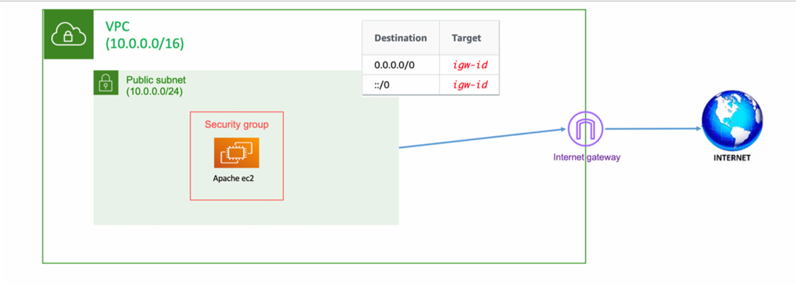

# Deploy Apache Web Server on AWS using Terraform

## Overview
This lab demonstrates how to deploy an Apache web server in AWS using Terraform. The setup includes a Virtual Private Cloud (VPC), a public subnet, an internet gateway, a route table, a security group, and an EC2 instance running Apache.

## Architecture
The following resources are provisioned:
- **VPC** (10.0.0.0/16) to provide network isolation.
- **Public Subnet** (10.0.0.0/24) for the EC2 instance.
- **Internet Gateway (IGW)** for outbound internet access.
- **Route Table** with a default route to the IGW.
- **Security Group** allowing HTTP (80) and SSH (22) traffic.
- **EC2 Instance** running Apache.

## Prerequisites

Ensure you have the following installed before running Terraform:

- **Terraform CLI** (v1.0+ recommended)
- **AWS CLI**

## Deployment Steps

- Clone the repository:
`git clone https://github.com/youssefahmed8/Terraform-ITI.git`

`cd Terraform-ITI/Day_1`

- Initialize Terraform:
`terraform init`

- Plan the infrastructure:
`terraform plan`

- Apply the configuration:
`terraform apply`

## Open a web browser and navigate to http://<`EC2_PUBLIC_IP`> to view the Apache welcome page.

- This is the expected output

